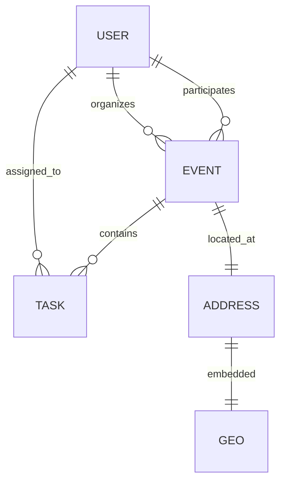
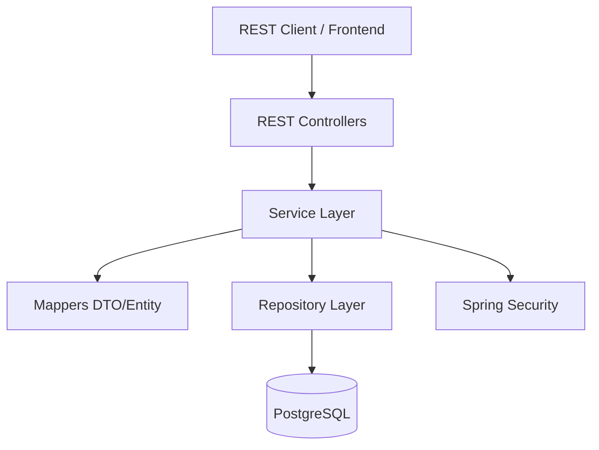

# Events Planner API

A robust Spring Boot REST API for managing events and tasks, designed with SOLID principles and maintainable architecture.

## 🚀 Capabilities

- **User Management**: Registration, authentication, and profile management.
- **Event Planning**: Create and manage events with titles, descriptions, dates, and locations.
- **Task Management**: Assign tasks to specific events and users, with due date validation.
- **Role-Based Access Control**: Different permissions for Users and Admins.
- **Data Integrity**: Comprehensive validation for dates and mandatory fields.
- **Statistics**: Admin dashboard for monitoring system-wide activity.

## 🛠 Tech Stack

- **Java 25**
- **Spring Boot 4.0.1**
- **Spring Security** (Session-based Authentication)
- **Spring Data JPA**
- **PostgreSQL**
- **Flyway** (Database Migrations)
- **Docker Compose**
- **Maven**

## 📊 System Architecture

### Entity Relationship Diagram



### High-Level Architecture



## ⚙️ Local Setup

### Prerequisites

- **Java 25** installed.
- **Docker** and **Docker Compose** installed.
- **Maven** installed (or use the provided `./mvnw`).

### Steps

1. **Clone the repository**:
   ```bash
   git clone <repository-url>
   cd events-planner
   ```

2. **Start the Database**:
   The project uses `spring-boot-docker-compose`. If you have Docker running, the database will start automatically when you run the application. Alternatively, you can start it manually:
   ```bash
   docker-compose up -d
   ```

3. **Run the Application**:
   ```bash
   ./mvnw spring-boot:run
   ```
   The API will be available at `http://localhost:8080`.

4. **Run Tests**:
   ```bash
   ./mvnw test
   ```

## 🔑 Authentication

The API uses session-based authentication.

- **Register**: `POST /api/auth/register`
- **Login**: `POST /api/auth/login`
- **Logout**: `POST /api/auth/logout`
- **Current User**: `GET /api/me`

## 📑 Main API Endpoints

### Events
- `GET /api/events` - List events (personalized for users, all for admins).
- `POST /api/events` - Create a new event.
- `GET /api/events/{id}` - Get event details.
- `POST /api/events/{id}/members/{userId}` - Add a participant.

### Tasks
- `GET /api/tasks` - List tasks assigned to the current user.
- `POST /api/tasks` - Create a task (must be linked to an event).
- `PATCH /api/tasks/{id}/toggle` - Mark task as completed/incomplete.

### Admin
- `GET /api/admin/stats` - System-wide statistics.
- `GET /api/admin/users` - Manage user accounts.

## 📐 Design Principles

This project follows:
- **SOLID Principles**: Focused responsibilities, decoupled mappers, and clear abstractions.
- **Layered Architecture**: Separation of concerns between controllers, services, and repositories.
- **DTO Pattern**: Using Java Records for type-safe data transfer.
- **Database Migrations**: Versioned schema changes using Flyway.
