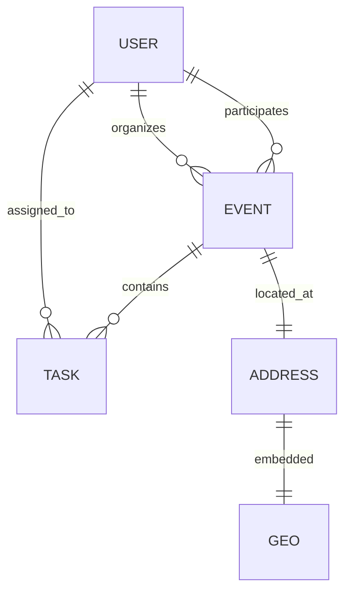
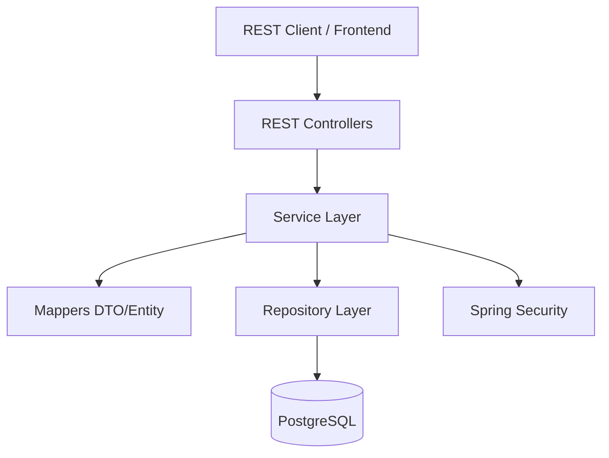

# Events Planner API

A robust Spring Boot REST API for managing events and tasks, designed with SOLID principles and maintainable architecture.

## 🚀 Capabilities

- **User Management**: Registration, authentication, and profile management.
- **Event Planning**: Create and manage events with titles, descriptions, dates, and locations.
- **Task Management**: Assign tasks to specific events and users, with due date validation.
- **Role-Based Access Control**: Different permissions for Users and Admins.
- **Data Integrity**: Comprehensive validation for dates and mandatory fields.
- **Statistics**: Admin dashboard for monitoring system-wide activity.

## 🛠 Tech Stack

- **Java 25**
- **Spring Boot 4.0.1**
- **Spring Security** (Session-based Authentication)
- **Spring Data JPA**
- **PostgreSQL**
- **Flyway** (Database Migrations)
- **Docker Compose**
- **Maven**

## 📊 System Architecture

### Entity Relationship Diagram



### High-Level Architecture



## ⚙️ Local Setup

### Prerequisites

- **Java 25** installed.
- **Docker** and **Docker Compose** installed.
- **Maven** installed (or use the provided `./mvnw`).

### Steps

1. **Clone the repository**:
   ```bash
   git clone <repository-url>
   cd events-planner
   ```

2. **Start the Database**:
   The project uses `spring-boot-docker-compose`. If you have Docker running, the database will start automatically when you run the application. Alternatively, you can start it manually:
   ```bash
   docker-compose up -d
   ```

3. **Run the Application**:
   ```bash
   ./mvnw spring-boot:run
   ```
   The API will be available at `http://localhost:8080`.

4. **Run Tests**:
   ```bash
   ./mvnw test
   ```

## 🔑 Authentication

The API uses session-based authentication.

- **Register**: `POST /api/auth/register` -> `{"message": "string"}` or `{"error": "string"}`
- **Login**: `POST /api/auth/login` -> `{"message": "string"}` or `{"error": "string"}`
- **Logout**: `POST /api/auth/logout` -> `204 No Content`
- **Current User**: `GET /api/me` -> `{"authenticated": boolean, "id": "UUID string", "username": "string", "roles": ["string"]}`

## 📑 Main API Endpoints

### Events
- `GET /api/events` - List events (personalized for users, all for admins). Returns `List<EventSummaryDTO>`.
- `POST /api/events` - Create a new event. Returns `EventDetailDTO`.
- `GET /api/events/{id}` - Get event details. Returns `EventDetailDTO`.
- `PUT /api/events/{id}` - Update event details. Returns `EventDetailDTO`.
- `DELETE /api/events/{id}` - Delete an event. Returns `204 No Content`.
- `GET /api/events/{id}/members` - Get event members. Returns `Set<UserSummaryDTO>`.
- `GET /api/events/{id}/organizers` - Get event organizers. Returns `Set<UserSummaryDTO>`.
- `POST /api/events/{id}/members/{userId}` - Add a participant. Returns `EventDetailDTO`.
- `DELETE /api/events/{id}/members/{userId}` - Remove a participant. Returns `EventDetailDTO`.
- `POST /api/events/{id}/organizers/{userId}` - Add an organizer. Returns `EventDetailDTO`.
- `DELETE /api/events/{id}/organizers/{userId}` - Remove an organizer. Returns `EventDetailDTO`.

### Tasks
- `GET /api/tasks` - List tasks assigned to the current user (can be filtered by `eventId`). Returns `List<TaskSummaryDTO>`.
- `POST /api/tasks` - Create a task (must be linked to an event). Returns `TaskDetailDTO`.
- `GET /api/tasks/{id}` - Get task details. Returns `TaskDetailDTO`.
- `PUT /api/tasks/{id}` - Update task details. Returns `TaskDetailDTO`.
- `DELETE /api/tasks/{id}` - Delete a task. Returns `204 No Content`.
- `PATCH /api/tasks/{id}/toggle` - Mark task as completed/incomplete. Returns `TaskDetailDTO`.

### Users
- `GET /api/users` - List all user summaries. Returns `List<UserSummaryDTO>`.

### Admin
- `GET /api/admin/stats` - System-wide statistics. Returns `AdminStatsDTO`.
- `GET /api/admin/users` - List all users with details. Returns `List<UserDetailDTO>`.
- `GET /api/admin/users/{id}` - Get user details. Returns `UserDetailDTO`.
- `POST /api/admin/users` - Create a new user (Admin only). Returns `UserDetailDTO`.
- `PUT /api/admin/users/{id}` - Update user details. Returns `UserDetailDTO`.
- `DELETE /api/admin/users/{id}` - Delete a user. Returns `204 No Content`.

## 📦 Data Transfer Objects (DTOs)

Below are the details of the DTOs used by the API, providing clarity on the expected fields and types for the frontend.

### User DTOs
#### `UserSummaryDTO`
Used for lists and nested user references where minimal info is needed.
- `id`: `UUID`
- `username`: `String`
- `avatar`: `String` (nullable)

#### `UserDetailDTO`
Detailed user information, typically used in Admin views.
- `id`: `UUID`
- `username`: `String`
- `email`: `String`
- `enabled`: `boolean`
- `accountNonLocked`: `boolean`
- `avatar`: `String` (nullable)
- `failedLoginAttempts`: `int`
- `lastLogin`: `OffsetDateTime`
- `createdAt`: `OffsetDateTime`
- `updatedAt`: `OffsetDateTime`
- `authorities`: `Set<String>` (e.g., `["ROLE_USER", "ROLE_ADMIN"]`)

### Event DTOs
#### `EventSummaryDTO`
Used when listing events.
- `id`: `UUID`
- `title`: `String`
- `description`: `String`
- `date`: `OffsetDateTime`
- `locationName`: `String`
- `participantCount`: `long`
- `taskCount`: `long`
- `hasUnfinishedTasks`: `boolean`

#### `EventDetailDTO`
Detailed event information.
- `id`: `UUID`
- `title`: `String`
- `description`: `String`
- `date`: `OffsetDateTime`
- `address`: `AddressDTO`
- `organizers`: `Set<UserSummaryDTO>`
- `members`: `Set<UserSummaryDTO>`
- `tasks`: `Set<TaskSummaryDTO>`
- `createdAt`: `OffsetDateTime`
- `updatedAt`: `OffsetDateTime`

#### `AddressDTO`
- `id`: `UUID`
- `street`: `String`
- `city`: `String`
- `zipCode`: `String`
- `country`: `String`
- `locationName`: `String`
- `latitude`: `Double` (nullable)
- `longitude`: `Double` (nullable)

### Task DTOs
#### `TaskSummaryDTO`
- `id`: `UUID`
- `description`: `String`
- `completed`: `boolean`
- `dueDate`: `OffsetDateTime`
- `assignedToId`: `UUID`
- `assignedToUsername`: `String`
- `eventId`: `UUID`

#### `TaskDetailDTO`
- `id`: `UUID`
- `description`: `String`
- `completed`: `boolean`
- `dueDate`: `OffsetDateTime`
- `assignedTo`: `UserSummaryDTO`
- `eventId`: `UUID`
- `createdAt`: `OffsetDateTime`
- `updatedAt`: `OffsetDateTime`

### Admin DTOs
#### `AdminStatsDTO`
- `totalUsers`: `long`
- `totalEvents`: `long`
- `totalTasks`: `long`
- `completedTasks`: `long`
- `taskCompletionRate`: `double`
- `activeOrganizers`: `long`

## 📐 Design Principles

This project follows:
- **SOLID Principles**: Focused responsibilities, decoupled mappers, and clear abstractions.
- **Layered Architecture**: Separation of concerns between controllers, services, and repositories.
- **DTO Pattern**: Using Java Records for type-safe data transfer.
- **Database Migrations**: Versioned schema changes using Flyway.
